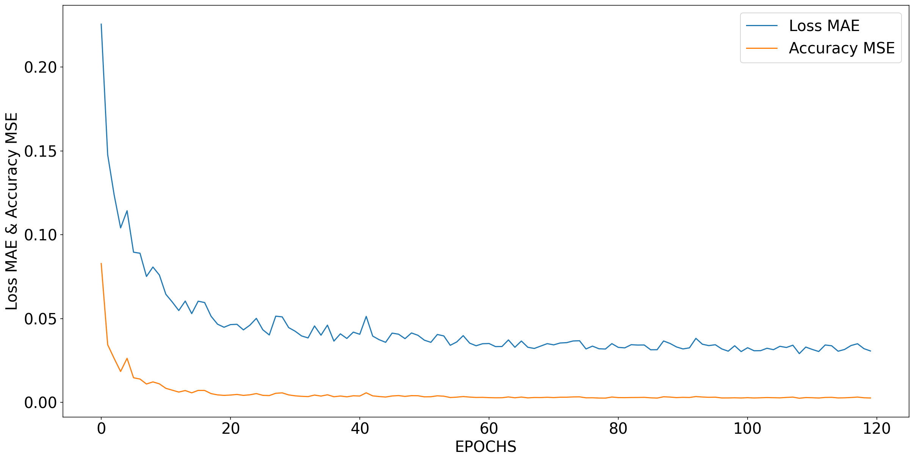

# **Belgium OBU Data Analysis and Modeling**

This project utilizes the [Belgium OBU Dataset](https://www.kaggle.com/datasets/giobbu/belgium-obu/data) to explore, preprocess, and model the data for time-series predictions. It includes a comparative analysis of different neural network architectures, such as LSTM and LSTM-FCN, and evaluates the impact of using an extended feature set.

---

## **Dataset**
- **Source**: [Belgium OBU Dataset](https://www.kaggle.com/datasets/giobbu/belgium-obu/data)
- **Description**: The dataset contains observational data collected from onboard units (OBUs) in vehicles. It includes features suitable for time-series analysis.

The following datasets were used in this project:

1. **And_05min_0101_0103_2019.csv** (111.12 MB)  
2. **Bel_30min_0101_0103_2019.csv** (444.44 MB)  
3. **Bel_30min_1303_0606_2021.csv** (332.88 MB)  
4. **Bel_30min_0506_1610_2021.csv** (635.36 MB)

You can download them directly from the Kaggle dataset linked below:

[Belgium OBU Dataset on Kaggle](https://www.kaggle.com/datasets/giobbu/belgium-obu/data)

---

## **Project Structure**
The project is organized into the following Jupyter notebooks:

1. **Data Exploration (`BD10_Data_Exploration.ipynb`)**  
   - Provides an initial exploration of the Belgium OBU dataset.
   - Includes data visualization and summary statistics.
   - Identifies key trends and patterns in the data.

2. **Data Preprocessing (`Data_Preprocessing.ipynb`)**  
   - Handles missing values, outliers, and data normalization.
   - Splits the dataset into training, validation, and testing sets.
   - Prepares features for model input with an emphasis on feature engineering.

3. **LSTM Model Implementation (`LSTM.ipynb`)**  
   - Implements a Long Short-Term Memory (LSTM) network for time-series forecasting.
   - Compares the performance of the LSTM model using:
     - **4 features** as done in [this Kaggle notebook](https://www.kaggle.com/code/giobbu/simple-lstm-tensorflow).
     - **9 features**, including additional engineered features for better temporal analysis.
   - Visualizes training performance and evaluates model accuracy.

   
   

4. **LSTM-FCN Model Implementation (`LSTM_FCN.ipynb`)**  
   - Introduces an LSTM-Fully Convolutional Network (FCN) hybrid model.
   - Evaluates its performance using the 9-feature dataset.
   - Includes metrics like accuracy, precision, recall, and F1-score.

   
   

5. **Model Performance Comparison (`Compare_Model_Performance.ipynb`)**  
   - Analyzes the performance of LSTM and LSTM-FCN models.
   - Provides a comparative study of models trained on:
     - 4 features (from the Kaggle reference notebook).
     - 9 features (engineered in this project).
   - Visualizes the impact of feature expansion on prediction accuracy and other performance metrics.

---

## **Technologies Used**
- **Languages**: Python  
- **Frameworks**: TensorFlow, Keras  
- **Libraries**: NumPy, pandas, matplotlib, seaborn, scikit-learn  
- **Tools**: Jupyter Notebook  
